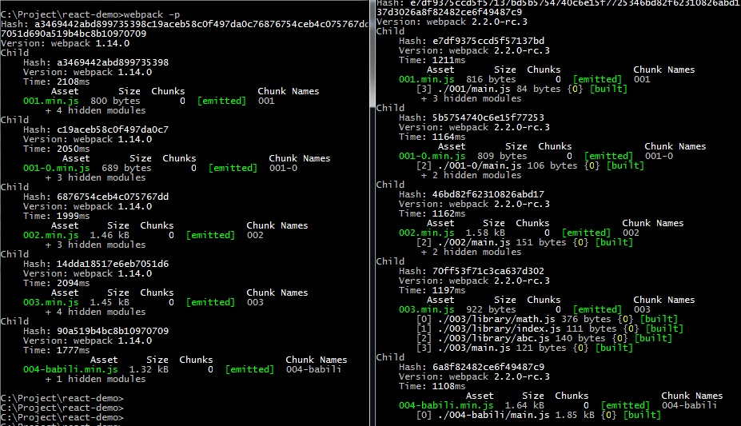

#Webpack2 新功能尝试

里面只有6.5的demo, 后续还会增加。
其中 1－4 都是tree-shaking的尝试， 05 是chunk分离，06 是 code splitting。
`webpack1-result` 文件夹中放置的是01-04使用webpack1打包后的文件。
运行

```sh
npm run 00数字
npm run 00数字-p //-p 一般是压缩版 带有min

npm run 01-04 // 一起运行01, 01-0, 02, 03, 04-babili
```

## tree-shaking

声明：这部分文案与demo主要来源于[webpack2 的 tree-shaking 好用吗？](http://www.open-open.com/lib/view/open1483144941161.html)。
03 是webpack官方demo，我稍微改变了组织结构。

tree-shaking 的作用是消除死代码，比如有些方法写了根本没用到，但是没有删掉，那么webpack在合并文件的时候识别这些方法，在最后打包的时候删除。一定要切记 webpack 的步骤，合并文件只标记unused方法，在压缩的时候才会删除。

请看案例001：

```
// main.js
import { A, B } from './components/index';
let a = new A();
console.log(a.render());

// components/index
import A from './A';
import B from './B';
export { A, B };

// A.js
function A() {
    this.render = function() {
        return "AAAA";
    }
}
export default A;

// B.js
function B() {
    this.render = function() {
        return "BBBB";
    }
}
export default B;
```

非常简单的例子，我们希望的是把B消除。
运行`npm run 001`后，找到`js/001.js`, 打开后会发现这样一段代码：

```js
/* unused harmony reexport B */

... ...

/***/ },
/* 2 */
/***/ function(module, exports, __webpack_require__) {

"use strict";
function B() {
    this.render = function () {
        return "BBBB";
    };
}

/* unused harmony default export */ var _unused_webpack_default_export = B;
```

有很多`unused`注释，而在`webpack1-result/001.js` 中没有这样的注释。

运行`npm run 001-p`，找到`js/001.min.js`, 打开后会发现这样一段代码：

```
function(n,t,e){"use strict";function r(){this.render=function(){return"AAAA"}}t.a=r}
```

没有`BBBB`! 说明tree shaking起作用了。在`webpack1-result/001.min.js`中你会发现`BBBB`。

demo001-0 是在01的基础上修改了导入方式，tree shaking起作用了，但是文件大小不一样。

demo002 采用了class的写法，tree shaking 失败。因为class经过babel编译后带有side effect的函数，`uglify-js`还不能消除这些函数，最后打包的文件依然含有`BBBB`。

demo3 是官网tree shaking的案例，它运作的很好。

demo004 是如何消除class B的一个方案， 使用了[babili]
(http://babeljs.io/blog/2016/08/30/babili?exports=guy&utm_source=tuicool&utm_medium=referral)，
`babili`是babel的压缩工具。
我们通常选用的方案是：
> ES2015+ code -> Babel -> Uglify -> Minified ES5 Code

`babili` 简化了中间的两个步骤，变成了：
> ES2015 code -> Babili -> Minified ES2015 Code

`004.js`就是`babili`压缩后的代码，IE上是不能运行的，其他高版本浏览器可以运行。

虽然现在的高级浏览器已经部分支持es6了，但是由于低版本浏览器的顽固存在，所以还需要把最后的压缩的es2015代码再次转义，那么即使死代码消除了，第二次编译后，文件体积又增加上去了，而且过程很繁琐。

demo004-babili是把 004.js 当作main.js，在babili的壳上又经过babel和webpack二次编译，导致最后打包出来的东西很大。
请原谅我目前使用这么糟糕的办法，如果有更好的方案，请通知我！

所以目前的结论是，如果是用`function`组织的代码，tree-shaking会工作的很好。

下面贴一张webpack两个版本的打包图：


是不是觉得和想象中的不太一样，01，02，04居然是2.x的版本比1.x大！
其实原因很容易发现，我们打开两个版本的合并文件，会发现2.x 多了这么一串东西：

```
/******/ 	// identity function for calling harmony imports with the correct context
/******/ 	__webpack_require__.i = function(value) { return value; };

/******/ 	// define getter function for harmony exports
/******/ 	__webpack_require__.d = function(exports, name, getter) {
/******/ 		if(!__webpack_require__.o(exports, name)) {
/******/ 			Object.defineProperty(exports, name, {
/******/ 				configurable: false,
/******/ 				enumerable: true,
/******/ 				get: getter
/******/ 			});
/******/ 		}
/******/ 	};

/******/ 	// getDefaultExport function for compatibility with non-harmony modules
/******/ 	__webpack_require__.n = function(module) {
/******/ 		var getter = module && module.__esModule ?
/******/ 			function getDefault() { return module['default']; } :
/******/ 			function getModuleExports() { return module; };
/******/ 		__webpack_require__.d(getter, 'a', getter);
/******/ 		return getter;
/******/ 	};

```

看注释我们也能了解到，这是webpack为了mark死代码用的，所以，在极小极小的代码打包中，1.x 是优于 2.x, 可是你确定你的项目会跟demo一样只用几行语句么？！ 所以文件稍微多些，03的效果就很明显了。

## Caching
demo05 是使用chunkhash做浏览器的cach方案的单页应用案例，原文请戳[这里](https://webpack.js.org/guides/caching/)。

通常来说，我们经常改动的是业务代码，里面的依赖是不会变动的，那么我们应该把这些不会经常变更的部分抽离出来作为`vendor.js`,

首先，我们需要配置两个入口,

```
entry: {
    '005': './main.js',
    'vendor': './vendor.js'
},
output: {
    path: './js/005',
    filename: "[name].[chunkhash].js",
    chunkFilename: "[id].[chunkhash].js"
},

```

其中`main.js`是页面入口，


```
import React from 'react';
import ReactDOM from 'react-dom';


const render = () => {
  ReactDOM.render(
		<h1>hello~</h1>,
    document.getElementById('root')
  );
};

render();
```

`vendor.js`放置是项目依赖，比如：


```
require('react');
require('react-dom');
```

这个时候运行webpack, 会得到两个有hash值的文件，`005.js` 和 `vendor.js`，两个文件里都包含了`react` 和 `react-dom`，这个时候，我们需要使用`CommonsChunkPlugin`帮助我们把`005.js`中的依赖抽离出去。

dev环境配置如下：

```
new webpack.optimize.CommonsChunkPlugin({
    name: ['vendor', 'manifest'],
    minChunks: Infinity
})

```
这样会生成`005.js`、`vendor.js`、`manifest.js`，它们都带有hash值。`manifest.js`是业务代码和依赖代码的map文件。
在`--watch`模式下运行，会发现每次`main.js`的更改，`005.js`和`manifest.js`都会重新生成，而`vendor.js`不会更改。这样浏览器就能缓存`vendor.js`，只重新请求`005.js`和`manifest.js`。

在prod环境中，最后一项`manifest`可以不用配置。因为最后的build可以不需要映射文件。

然而随着依赖越来越多，vendor越来越大，可爱的webpack会提示你需要进行code-splitting来减小单个文件的体积。

##code-splitting

在网页中需要动态加载组件的场景很多，有些模块很少使用，不需要一开始就加载进来，有些页面访问次数很少比如"关于我们"、“意见反馈”等，那么这些资源应当是用户点击之后再进行加载。这时候就需要分离代码了。

demo06 是code-splitting的小尝试。在 1.x 版本中，webpack是使用`require.ensure()`进行代码分离的。`require.ensure()`是commonJS风格的异步加载方式，使用回调函数把请求的组件传出去。其中加载的代码会分离到一个chunk块中。

```
require.ensure([], function(require){
    require('./a.js');
});
```

现在 2.x 新增了`import()`语法来动态加载资源，它是同步的。

```
async function getTemplate(templateName) {
	try {
		let template = await import(`./templates/${templateName}`);
		console.log(template);
	} catch(err) {
		console.error("template error");
		return new Error(err);
	}
}
```

也可以使用`System.import()`, 它会返回一个`Promise`对象。但是因为会被弃用，所以demo里面不演示了。

```
System.import("b").then(function(b) {
	console.log("b loaded", b);
})
```

在 demo 里面，主要动态加载了`moment`组件和一个json文件，现在 2.x 内置了`json-loader`，不需要再次添加。
打包出来会有`0.hashcode.js` 和 `1.hashcode.js`两个文件，分别是moment和json文件。当点击相应的按钮的时候，页面才会动态去请求对应的js文件。

目前这是对js进行的代码分离，还有css的。

待续。。。
